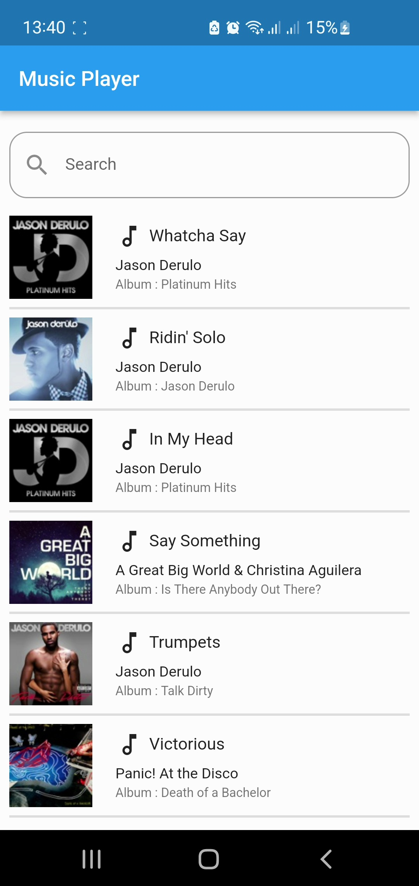
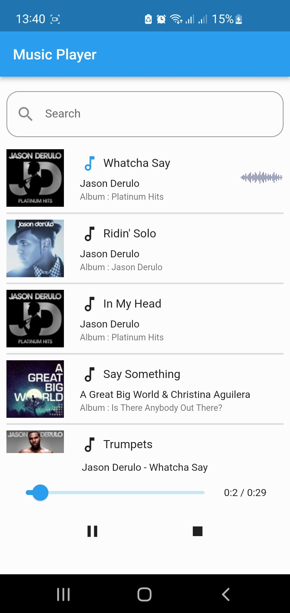
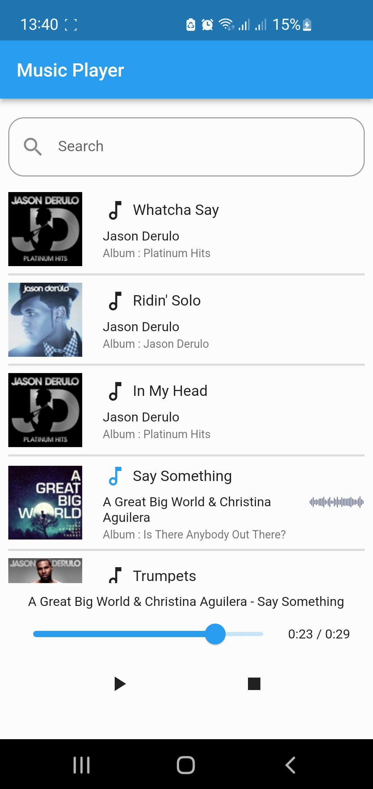
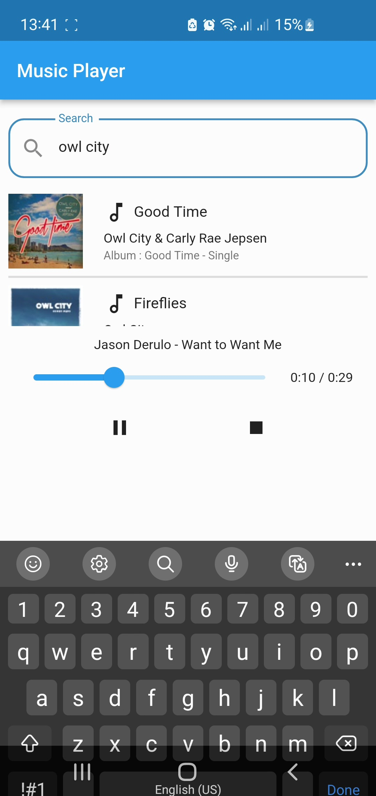
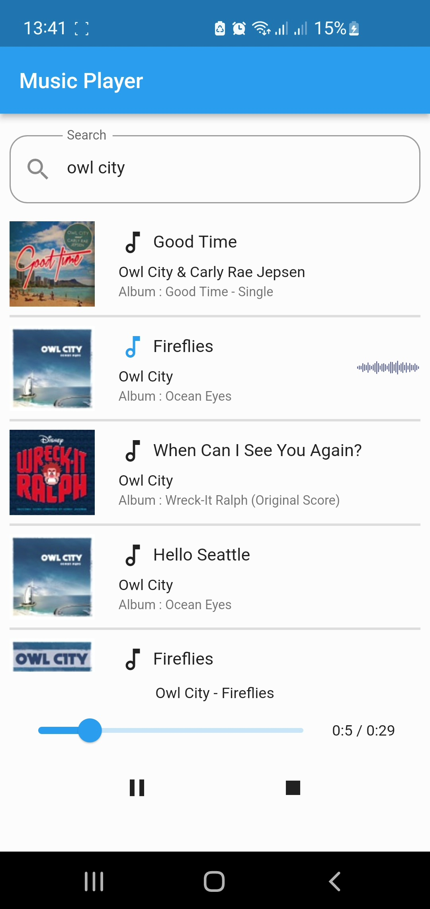

# Project Name
> Music Player form iTunes.
> Live Demo [_here_](https://drive.google.com/file/d/1VQgqlHmE0hfdRrmrJW-fCw-Z6-GXJMog/view?usp=sharing).

## Table of Contents
* [General Info](#general-information)
* [Technologies Used](#technologies-used)
* [Library Used](#library-used)
* [Features](#features)
* [Screenshots](#screenshots)
* [Build & Deploy](#build-deploy)
* [Acknowledgements](#acknowledgements)

## General Information
- Provide general information about your project here.
- What problem does it (intend to) solve?
- What is the purpose of your project?
- Why did you undertake it?
<!-- You don't have to answer all the questions - just the ones relevant to your project. -->

## Technologies Used
- Android Studio - version 2021.2.1
- Android SDK - version 31.0.0
- Flutter - version 2.10.2
- Dart - version 2.16.1
- Android Virtual Device - Pixel 2 API 24 Android 7.0 x86_64 Nougat

## Library Used
- audioplayers - version 0.20.1 
- get - version 4.6.1 
- http - version 0.13.4 
- lottie - version 1.2.1

## Features
- Play Preview Song
- Play / Pause / Stop / Seek Song
- Search for Artist / Song / Album

## Screenshots

## Build Deploy
- Build -> Flutter -> Build APK

## Acknowledgements
- This project use search api from [iTunes](https://developer.apple.com/library/archive/documentation/AudioVideo/Conceptual/iTuneSearchAPI/index.html#//apple_ref/doc/uid/TP40017632-CH3-SW1)
